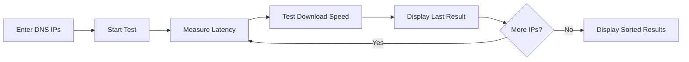

# 🌐 DNS Speed Tester

A cross-platform Terminal User Interface (TUI) tool to benchmark DNS servers for **latency** and **download speed**.


## ✨ Features

- 🚀 **Latency Testing** - Measures DNS resolution time
- 📥 **Download Speed Testing** - Tests CDN routing quality via each DNS
- 📊 **Sortable Results** - Sort by IP, latency, or download speed
- 🎨 **Beautiful TUI** - Built with [Ratatui](https://ratatui.rs/)
- 🔄 **Cross-Platform** - Works on Linux, macOS, and Windows

## 📦 Installation

### From Source

```bash
# Clone the repository
git clone https://github.com/yourusername/dns-speed-tester.git
cd dns-speed-tester

# Build release binary
cargo build --release

# Run it
./target/release/DNS
```

### Prerequisites

- 🦀 Rust 1.70 or higher
- 📡 Internet connection for speed tests

## 🚀 Quick Start

```bash
# Run the application
cargo run --release

# Run with initial DNS servers
cargo run --release -- -d 8.8.8.8,1.1.1.1,9.9.9.9

# Load DNS servers from a JSON file
cargo run --release -- --json examples/dns.json

# Load DNS servers from a CSV file
cargo run --release -- --csv examples/dns.csv
```

---

## 🛠️ CLI Options

| Argument | Description | Example |
|----------|-------------|---------|
| `-d`, `--dns` | Comma-separated list of DNS IPs | `-d 8.8.8.8,1.1.1.1` |
| `--json` | Path to JSON file `[{"ip": "..."}]` | `--json servers.json` |
| `--csv` | Path to CSV file (header `ip` required) | `--csv servers.csv` |

## 📖 Usage

### 1️⃣ Add DNS Servers

Type an IP address and press **Enter** to add it to the list. You can also load them via CLI arguments (see [CLI Options](#️-cli-options)).

```
8.8.8.8        # Google DNS
1.1.1.1        # Cloudflare DNS
```

### 2️⃣ Start Testing

Press **Tab** to begin the benchmark. The tool will iterate through your list:
1. 📍 **Latency**: Resolves `www.google.com`
2. 📥 **Download Speed**: Benchmarks a 1MB transfer from Cloudflare CDN
3. ⏱️ **Strict Timeout**: Each test is strictly limited to **7.5 seconds** to ensure slow servers don't hang the process.

### 3️⃣ Real-time Monitoring

While testing, the TUI shows:
- 📊 **Progress Bar**: Turns black-on-green after 50% completion for high visibility.
- 🔄 **Current Status**: Shows the IP currently being tested.
- ✅ **Last Result**: Displays the latency and speed of the immediate predecessor test in real-time.

### 4️⃣ View Results

After completion, view the results in a sortable table. Press `s` to cycle sorting (IP, Latency, Speed) and `d` to toggle direction.

## ⌨️ Keyboard Controls

| Key           | Action                          |
|---------------|---------------------------------|
| `Enter`       | ➕ Add DNS IP address           |
| `Backspace`   | ❌ Remove character/last DNS   |
| `Tab`         | ▶️ Start testing                |
| `s`           | 🔄 Cycle sort column            |
| `d`           | ↕️ Toggle sort direction        |
| `r`           | 🔁 Run new test                 |
| `q`           | 🚪 Quit                         |

## 🛠️ How It Works



1. **Latency Test**: Resolves `www.google.com` using the target DNS.
2. **Download Test**: Connects directly to a resolved CDN IP to measure throughput.
3. **Execution Guard**: A `tokio::time::timeout` enforces a **7.5s hard limit** per DNS server.

## 📁 Project Structure

```
src/
├── main.rs       # 🚀 Entry point & event loop
├── app.rs        # 📱 Application state management
├── ui.rs         # 🎨 TUI rendering
└── dns_utils.rs  # 🌐 DNS testing logic
```

## 🔧 Dependencies

| Crate | Purpose |
|-------|---------|
| `ratatui` | 🎨 Terminal UI framework |
| `crossterm` | ⌨️ Cross-platform terminal handling |
| `tokio` | ⚡ Async runtime |
| `hickory-resolver` | 🌐 DNS resolution |
| `reqwest` | 📥 HTTP client for speed tests |

## 🐛 Troubleshooting

### ⚠️ Permission Denied on External Drives (NTFS/exFAT)

If you get this error when building:
```
Permission denied (os error 13)
could not execute process `.../build-script-build`
```

This happens because external drives (NTFS/exFAT) on Linux don't support execute permissions. Cargo's build scripts in the `target/` folder can't run.

**🔧 Quick Fix (one-time):**
```bash
CARGO_TARGET_DIR=/tmp/dns_target cargo build --release
```

**🔧 Permanent Fix:**
Add this to your `~/.bashrc` or `~/.zshrc`:
```bash
export CARGO_TARGET_DIR="$HOME/.cargo-target"
```

Then reload your shell:
```bash
source ~/.bashrc
```

Now `cargo build` will work from any external drive! 🎉

### DNS Resolution Timeout

Increase timeout in `src/dns_utils.rs`:

```rust
opts.timeout = Duration::from_secs(10); // Default is 5
```

## 📄 License

MIT License - feel free to use and modify!

## 🤝 Contributing

Contributions welcome! Feel free to:
- 🐛 Report bugs
- 💡 Suggest features
- 🔧 Submit pull requests

---

Made with ❤️ and 🦀 Rust
